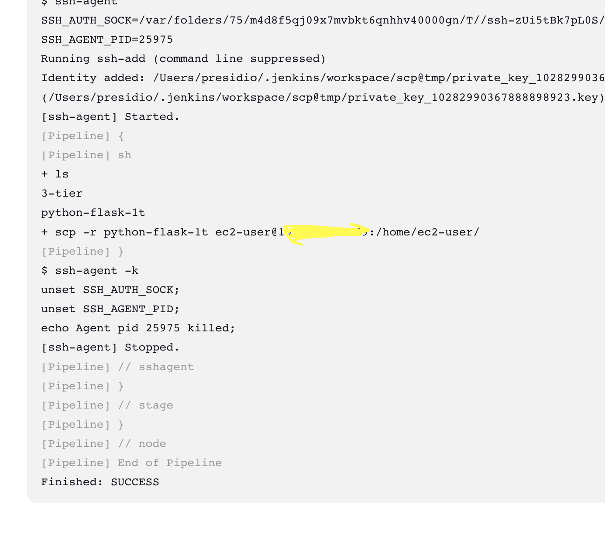
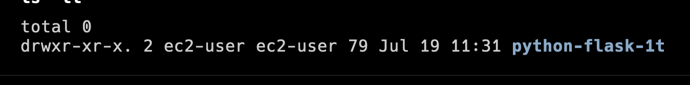

# Perform SCP by Jenkins to remote ec2 server

## Steps
(Support for MacOS)
### Setup jenkins in local
1. Install jenkins into local system

```
brew install jenkins-lts
brew services start jenkins-lts
```

2. Create new user & Install plugins
    - open localhost:8080 
        - copy the admin password from local 
        - select suggested plugins to download
        - select save and finish
    - restart and login
    - Go to Manage plugins
        - Select Plugins --> Available Plugins Make sure to install below plugins
            - SSH
            - SSH Agent
            - SCP
            - Github Integration
        - Choose Install and restart

3. Create ec2 server in aws
    - make sure to allow port 22 to your local ip in ec2 security group ingress 
    -  check the ssh connectivity from local

4. Validate ssh connection between jenkins and EC2
    - Go to Manage Jenkins --> Credentials under Security --> System --> Global Credentials --> Add Credentials
        - Kind: SSH Username with Private Key
        - id: scp-ec2-creds (can be annything)
        - Username: provide ec2 user name (ex: ec2-user, ubuntu etc)
        - Private Key: Choose Enter directly (paste your pem content in Key block)
        - Create credential 
    
    - Go to Manage Jenkins --> System -->  SSH remote hosts
        - ssh sites --> add new entry
            - Host: Ec2 public ip or DNS
            - Port: 22
            - Credentials: Select scp-ec2-creds you created in above step (username will be shown)
            - Test connection - Make sure it shows connected

5a. Jenkins to Github Webhook (NGROK)


or 
5b. Polling in jenkins
    - Create github credentials 
      - Manage Jenkins  --> Credentials --> System --> Global Credentials --> Add Credentials
        - Kind: username and password
        - Username: your github username
        - Password: Github token (Dont use password, use tokens)
        - Id: github-token
    - Jenkins  --> Dashboard --> New Item --> Pipeline  
        - Select Github Project - provide your git url
        - Pipeline 
            - Definition: Choose Pipeline Script, base below in the steps area
```
pipeline {
    agent any
    
    stages {
        stage('Git Clone'){
            steps {
                git credentialsId: 'github-token', url: 'https://github.com/SeethalakshmiB/docker-micro-service-example'
            }
        }
        
        stage('SCP copy') {
            steps {
                sshagent(['scp-ec2-creds']) {
                    sh '''
                    ls -ll
                    scp -r python-flask-1t ec2-user@<ec2_ip>:/home/ec2-user/
                    '''
                }
            }
        }
    }
}

```

Am copying a folder from the github to ec2 

#### Example output from jenkins and EC2



